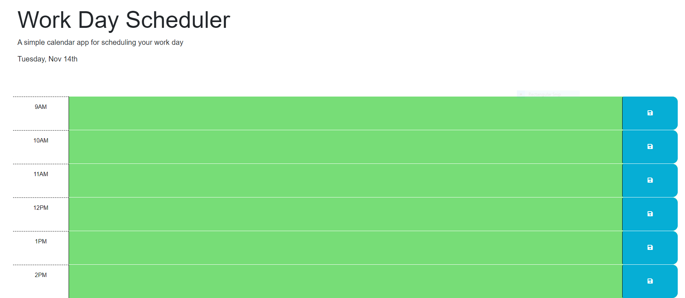

# Work Day Scheduler 

## Description

The goal for this challenge was to Create a simple calendar application that allows a user to save events for each hour of a typical working day (9am–5pm). This app will run in the browser and feature dynamically updated HTML and CSS powered by jQuery.. 

## Usage

link
https://jthomas47.github.io/Work-Day-Scheduler/

screenshot 

